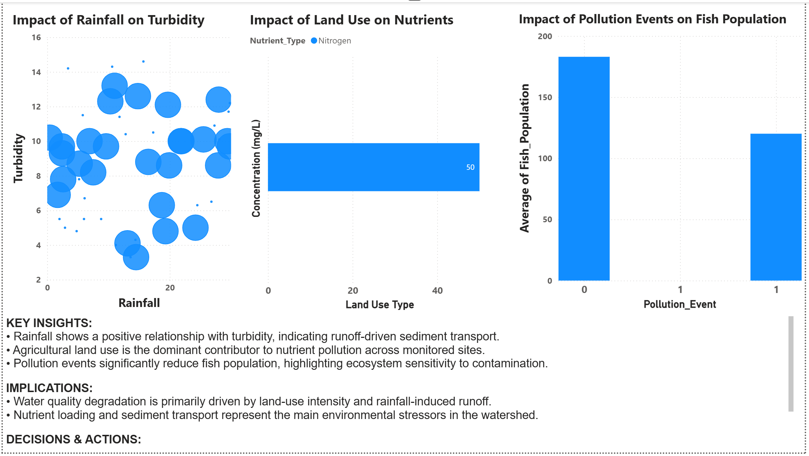
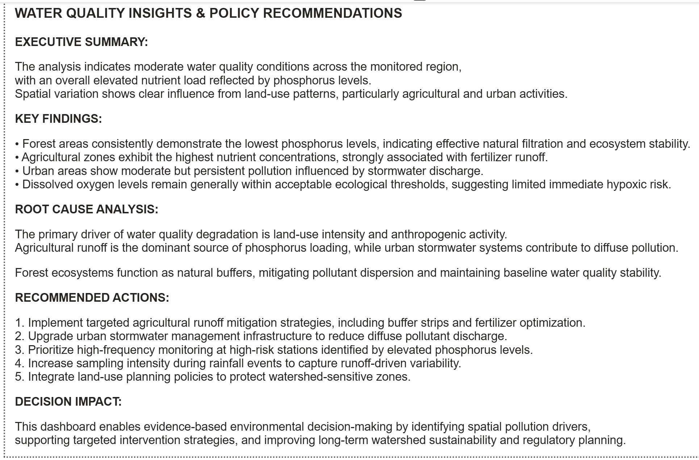

# 🌊 Watershed Water Quality Intelligence Dashboard  
### Multi-Factor Environmental Risk Analysis (Power BI)

---

## 📌 1. Project Overview

This project is an interactive **Power BI dashboard** designed to analyze watershed water quality and environmental risk patterns.

It integrates multiple environmental factors such as rainfall, land use, nutrient levels, and ecological indicators to understand pollution drivers and ecosystem response.

The goal is to enable **data-driven environmental monitoring and decision-making**.

---

## 🎯 2. Problem Statement

Water quality management is often challenged by:

- Lack of integrated environmental data analysis
- Difficulty identifying key pollution sources
- Limited visibility into land-use impact on water systems
- Weak understanding of ecosystem response to pollution events

---

## 🧠 3. Objectives

This dashboard aims to:

- Identify key drivers of water pollution
- Analyze spatial differences in water quality
- Evaluate impact of rainfall on turbidity and runoff
- Assess ecological consequences of pollution events

---

## 🗂 4. Data & Scope

**Data Sources (simulated / project dataset):**
- Water quality measurements (Phosphorus, DO, Turbidity)
- Land use classification (Agriculture, Urban, Forest)
- Rainfall records
- Ecological indicators (Fish population)

**Scope:**
- Watershed-level environmental analysis
- Station-based comparison
- Time-series environmental trends

---

## 🛠 5. Tools & Technologies

- Power BI Desktop
- Power Query (Data Cleaning & Transformation)
- DAX (KPI calculations & measures)
- Data Visualization & Dashboard Design

---

## ⚙️ 6. Data Processing Workflow

- Data cleaning and preprocessing in Power Query
- Feature transformation for environmental indicators
- KPI creation using DAX:
  - Average Phosphorus
  - Dissolved Oxygen (DO)
  - Turbidity Index
  - Water Quality Index (WQI)
- Data modeling for multi-table relationships

---

## 📊 7. Dashboard Features

- KPI Cards (WQI, DO, Turbidity, Phosphorus)
- Land-use comparison analysis
- Rainfall vs turbidity correlation view
- Ecosystem impact analysis (fish population trends)
- Interactive slicers (date, station, land use, metrics selector)

---

## 📈 8. Key Insights

- Agricultural land use is the primary driver of phosphorus pollution
- Rainfall events significantly increase turbidity levels due to runoff
- Forested areas stabilize water quality and reduce variability
- Pollution events correlate with declines in aquatic ecosystem health

---

## ⚠️ 9. Environmental Impact

- Nutrient pollution is strongly linked to agricultural activity
- Urban stormwater contributes to long-term diffuse contamination
- Rainfall accelerates pollutant transport into waterways
- Ecosystem health is highly sensitive to water quality variation

---

## 🧭 10. Recommendations

- Implement agricultural buffer zones to reduce runoff
- Improve urban stormwater drainage systems
- Increase monitoring frequency during rainfall events
- Prioritize intervention in high-risk pollution zones

---

## 🖼 11. Dashboard Preview

### Overview Dashboard  

### Environmental Analysis  

### Executive Summary  

---

## 📁 12. Project Structure
Watershed-Water-Quality-Intelligence-Dashboard/
│
├── Report/
│ ├── WaterQuality_Report.pdf
│ └── Water_Quality_Intelligence_Report.pdf
│
├── images/
│ ├── dashboard_overview.png
│ ├── environmental_analysis.png
│ └── executive_summary.png
│
├── WaterQuality.pbix
│
└── README.md

---

## 👤 13. Author

**R.R.MAO**  
Environmental Data Analyst Portfolio Project  
Focused on Water Quality Monitoring, Environmental Risk Analysis, and Data-Driven Sustainability Insights  

